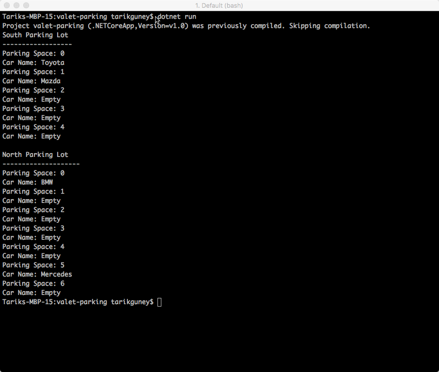

# How does this exercise work?

What's being checked with this exercise are the capabilities of an interviwee in the following areas:

1. Problem solving skills.
2. Conceptualizing skills.
3. Object oriented programming skills.

Keeping domain complexity in a reasonable level is important. It should be from where most developer feel comfortable with. Otherwise, the interviwee can spend unreasaonable amount of time to understand the question asked before even going into the implementation of the solution phase, and this gives a false negatives to the interviewers about the candidate, such as the candidate is not capable of necessary skills. Therefore, in this scenario, a common life situation is used: Valet Parking. It is easy to understand but also complex enough for an interview process. The complexity comes from the components involved and how these components interact with each other. There is not straightforward answer. It can be solved in many ways. However, it is important for a candidate to solve it in a way that is maintainable, unit testable, and human readable.

Aside from general and most important skills, the question also seeks for capabilities in the following areas:

1. Algorithms
2. Abstraction
3. Fundamental Object Oriented Programming Concepts: Inheritance, Composition, and Aggregation.
4. Design patterns: The solution can include Strategy Pattern, Abstract Factory, and Static Factory Method.
5. Data structure: The queue data structure is one of the most basic ones. Therefore, an engineer is still expected to use it comfortably.

The exercise is developed with the stress during an interview process in mind. Consequently, some of the things are kept simple. For instance, to get a car object, the interviewee can use the static factory method pattern instead of its more complex version: Abstract Factory Pattern. There are also some requirements which may look unneccessary; for instance, we don't use Age property of a valet, but the reason is to lead the interviee to using a class instead of a simple string variable. Therefore, those requirements are cues for the interviewee if s/he is familiar with the good programming concepts and practices.

# Code example

The code sample in the repository is A solution, not THE solution. It is developed to show a possible approach to the problem. However, the candidate may come up with a different and more novel approach.

# Question for Interviewee

In this exercise, we will write a fictional valet parking application. Simply speaking, in a valet parking service, a person called valet parks customers' cars to designated parking lots. Valet parking service is usually used in expensive restaurants and hotels. 

In our valet parking example, there will be three major components playing roles in the parking process:

1. Three types of vehicle: Sedan, Van, and Truck. For each vehicle, we store their Name (e.g. "Mazda") and Engine Size (e.g. "2.5", "3.0"). 
2. Two types of parking lot: North and South. **There can be many parking lots as of types North and South.** Although for now, there will be only two parking lots per parking lot types. Let's name north parking lots "N1-PL" and "N2-PL", and south parking lots as "S1-PL" and "S2-PL". All the north parking lots have only 10 parking spaces each, whereas, the south parking lots have 15 spaces each.
3. Two types of valets: Junior and Senior. There can be many junior or senior valets. For now, let's have "Michael" as senior valet and "Jack" as junior valet.

The junior and senior valets behave differently when parking customers' cars:

1. The junior valets park **randomly** to any available parking spot.
2. The senior valets park in **an orderly fashion** to the available parking spots.

Our parking scenario will look like the following:

There are 4 cars in the queue and they are: Two sedans: Toyota and Mazda both with an engine size 2.5; one van: "Mercedes" with an engine size 3.0; and one truck: GMC with an engine size 5.9. The parking takes place in the following **order**:

1. The 16-year old Jack gets the Mazda from the queue and parks it to N1-PL parking lot.
2. The 30-year old Michael gets Toyota and parks it into S1-PL parking lot.
3. The same junior Jack parks Mercedes to the N2-PL parking lot.
4. The same senior Michael parks the GMC to the S2-PL parking lot.

# Execution Result

Developed with Visual Code and DOTNET CORE with (love)...
